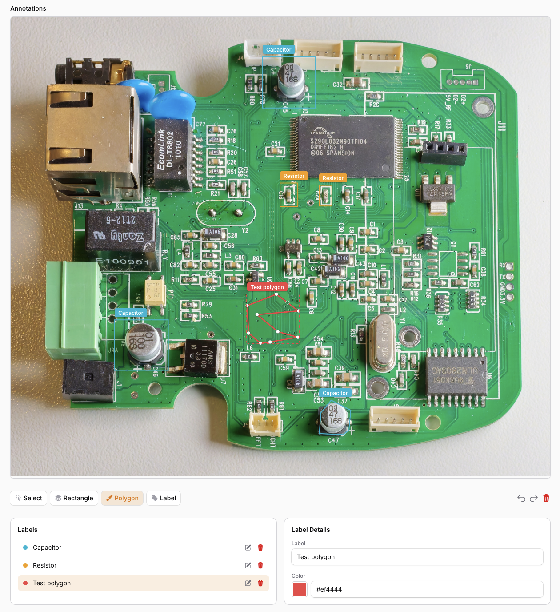

# Filament Image Labeler

[](https://packagist.org/packages/zielu92/filament-image-labeler)
[](https://github.com/zielu92/filament-image-labeler/actions?query=workflow%3Arun-tests+branch%3Amaster)
[](https://github.com/zielu92/filament-image-labeler/actions?query=workflow%3A"Fix+PHP+code+styling"+branch%3Amaster)
[](https://packagist.org/packages/zielu92/filament-image-labeler)
[](https://plumbphp.dev/zielu92/filament-image-labeler)

A Filament plugin for labeling images — draw rectangles and polygons, name them, color them, all inside one form field. Built on [Annotorious](https://annotorious.dev/), with a polymorphic persistence layer so any Eloquent model can keep its annotations.



## Features

- Annotation canvas with a toolbar under the image: **Select / Rectangle / Polygon / Label**, plus **undo / redo / delete**
- Built-in **Labels panel** — every distinct label gets a row with a color dot, edit and delete
- Built-in **Label Details panel** — rename a label (renames every shape using it) and pick its color
- Label pills rendered over the shapes on the canvas
- Two-way selection: click a shape to load its label, click a row to select the shape
- Polymorphic `annotations` table — attach annotations to any model
- `HasAnnotations` trait with `syncAnnotations()` for easy CRUD
- **Optional entity links** — link a shape to a record in your own app (a `Person`, a `Building`, anything): an inline entity picker in the Label Details panel searches across the types you configure, the linked entity shows as a chip, and the first link seeds an empty label with the record's display string
- **Optional automatic annotation** — a model overrides `autoAnnotate()` to turn an image into suggestions (any backend you like: local model, detection API, LLM); the editor gets an **Annotate** button, optionally auto-running when the image loads
- Works with private/public file storage, Filament v5 compatible, translations (en/de/pl)

## Installation

```bash
composer require zielu92/filament-image-labeler
php artisan migrate
```

## How It Works

`ImageLabel` is a self-contained form field. Its Livewire state is an array of shapes:

```json
[
    {
        "id": "uuid",
        "target": {
            "selector": {
                "type": "RECTANGLE",
                "geometry": { "x": 693, "y": 88, "w": 256, "h": 160, "bounds": { "minX": 693, "minY": 88, "maxX": 949, "maxY": 248 } }
            }
        },
        "label": "Microcontroller",
        "color": "#ef4444"
    }
]
```

- `target.selector` is Annotorious' internal geometry — pixel coordinates in the image's natural size; polygons use `{ "type": "POLYGON", "geometry": { "points": [[x, y], ...], "bounds": {...} } }`. Store it as-is, it round-trips.
- `label` is free text; shapes sharing a label share a row in the Labels panel.
- `color` is assigned deterministically from a hash of the label name and can be overridden per label in the UI. Colors are denormalized onto each shape, so the state array is all you need to persist.

## Usage

### 1. Add the trait to your model

```php
use Zielu92\FilamentImageLabeler\Concerns\HasAnnotations;

class Photo extends Model
{
    use HasAnnotations;
}
```

This gives your model `$photo->annotations()` (morphMany), `$photo->syncAnnotations(array $data)` and automatic cascade delete.

### 2. Add the field to your Filament form

```php
use Zielu92\FilamentImageLabeler\Forms\Components\ImageLabel;

ImageLabel::make('annotations')
    ->image(fn ($get, $record) => /* resolve the current photo URL */)
    ->live()
    ->columnSpanFull()
```

The `image` closure is re-evaluated whenever the form renders, so the canvas follows the form: make the photo field `->live()` and resolve the URL from its state (this also covers freshly uploaded, not-yet-saved files):

```php
->image(fn ($get, $record) => $record?->exists
    ? $record->getFirstMedia()?->getTemporaryUrl(now()->addHour())
    : ($get('photo') instanceof \Livewire\Features\SupportFileUploads\TemporaryUploadedFile
        ? $get('photo')->temporaryUrl()
        : null))
```

As a fallback the field also reacts to a `Livewire::dispatch('image-labeler-update-url', $url)` event. Pass the field's state path as a second argument (`..., $url, 'annotations')`) when a page renders multiple `ImageLabel` fields, so only the matching one updates.

### Keyboard

In edit mode: **Delete** / **Backspace** removes the selected shape(s), **Esc** deselects or cancels an in-progress polygon, and **Ctrl/Cmd+Z** / **Ctrl/Cmd+Y** (or the toolbar arrows) undo/redo.

### 3. Persist on save, hydrate on edit

Map the field state onto `syncAnnotations()` — the app decides what goes into `metadata`:

```php
/** @param array<array{id: string, target: array, label: string, color: string, entity?: array{type: string, id: int|string}|null}> $shapes */
function annotationRows(array $shapes): array
{
    return collect($shapes)->map(fn ($s) => [
        'annotation_id' => $s['id'],
        'geometry' => $s['target'],
        'metadata' => ['label' => $s['label'] ?? '', 'color' => $s['color'] ?? null],
    ])->all();
}
```

```php
// CreatePhoto.php
class CreatePhoto extends CreateRecord
{
    protected function mutateFormDataBeforeCreate(array $data): array
    {
        $this->annotationData = annotationRows($data['annotations'] ?? []);
        unset($data['annotations']);

        return $data;
    }

    protected function afterCreate(): void
    {
        $this->record->syncAnnotations($this->annotationData);
    }
}
```

```php
// EditPhoto.php
use Zielu92\FilamentImageLabeler\Support\AnnotationColor;

class EditPhoto extends EditRecord
{
    protected function mutateFormDataBeforeFill(array $data): array
    {
        $data['annotations'] = $this->record->annotations()->orderBy('id')->get()
            ->map(fn ($ann) => [
                'id' => $ann->annotation_id,
                'target' => $ann->geometry,
                'label' => $ann->metadata['label'] ?? '',
                'color' => $ann->metadata['color'] ?? AnnotationColor::forLabel($ann->metadata['label'] ?? ''),
            ])
            ->values()
            ->all();

        return $data;
    }

    protected function mutateFormDataBeforeSave(array $data): array
    {
        $this->annotationData = annotationRows($data['annotations'] ?? []);
        unset($data['annotations']);

        return $data;
    }

    protected function afterSave(): void
    {
        $this->record->syncAnnotations($this->annotationData);
    }
}
```

`AnnotationColor::forLabel('USB Port')` returns the same color the canvas picks for a label by default — use it when your metadata was saved without an explicit color.

## The `syncAnnotations` Method

```php
$model->syncAnnotations([
    [
        'annotation_id' => 'uuid-from-canvas',
        'geometry' => ['selector' => ['type' => 'RECTANGLE', 'geometry' => ['x' => 693, 'y' => 88, 'w' => 256, 'h' => 160, 'bounds' => ['minX' => 693, 'minY' => 88, 'maxX' => 949, 'maxY' => 248]]]],
        'metadata' => ['label' => 'Microcontroller', 'color' => '#ef4444'],
    ],
]);
```

**Behavior:** creates missing rows (matched by `annotation_id`), updates existing ones, deletes rows whose `annotation_id` is absent, `[]` clears all. `geometry` accepts an array or JSON string; `metadata` is nullable and yours to shape. Entity links: pass `entity_type` + `entity_id` as a pair; an explicit `null` clears the link, omitting the keys leaves the stored link untouched, and a half pair (one set, one null) is coerced to a full clear.

## Entity links

Opt in by declaring which record types shapes may link to:

```php
use Zielu92\FilamentImageLabeler\Forms\Components\ImageLabel;
use Zielu92\FilamentImageLabeler\Support\LinkableType;

ImageLabel::make('annotations')
    ->linkableTo([
        // Display convention: name column, else title, else "#<id>".
        LinkableType::make(Building::class),

        // Custom display: you must also tell the picker which columns to search.
        LinkableType::make(Person::class)
            ->display(fn (Person $person): string => "{$person->first_name} {$person->last_name}")
            ->searchBy(['first_name', 'last_name']),

        // Optional: allow creating a record from the picker with a form schema
        // (pass your Filament resource's form here if you have one).
        LinkableType::make(Vendor::class)
            ->creatable(fn () => [TextInput::make('name')->required()]),
    ])
```

What you get:

- An inline **entity picker** in the Label Details panel (not a modal): type to search every linkable type at once, results grouped by type. Binding requires a selected shape; linking seeds the shape's label with the record's display string only when the label is empty.
- An **entity chip** on the selected shape with unlink; relinking replaces the link.
- For `creatable()` types, a create entry in the picker opens a modal with your schema; the new record binds to the selected shape.
- Links persist in `entity_type` / `entity_id` columns on `annotations` (run `php artisan migrate`), not in `metadata`.

Persisting a link — the field state carries `entity: ['type' => ..., 'id' => ...]` per shape; map it onto the sync keys:

```php
'entity_type' => $s['entity']['type'] ?? null,
'entity_id' => $s['entity']['id'] ?? null,
```

Recommended: add the `LinkableEntity` trait to each linkable model so deleting a record nulls the links pointing at it:

```php
use Zielu92\FilamentImageLabeler\Concerns\LinkableEntity;

class Person extends Model
{
    use LinkableEntity;
}
```

Without the trait links dangle — the editor still renders them (with a class-name fallback) but nothing cleans them up. Stale links to types removed from `linkableTo()` keep rendering; only the picker stops offering them.

## Automatic annotation

Let a model label its own images. The package defines only *that* it happens and *what shape the answer has* — how you find things in the image is entirely yours (local model, hosted detector, vision LLM, hardcoded test data).

**1. Override the hook on your model.** The contract: return a list of `AnnotationSuggestion` **DTOs** (`label` + normalized `box`/`polygon`). The trait default returns `null`, which keeps the feature off:

```php
use Zielu92\FilamentImageLabeler\Concerns\HasAnnotations;
use Zielu92\FilamentImageLabeler\Support\AnnotationSuggestion;

class Photo extends Model
{
    use HasAnnotations;

    /**
     * @return list<AnnotationSuggestion>|null  one DTO per finding
     */
    public function autoAnnotate(string $url, ?string $path): ?array
    {
        // $url  - the image URL the editor currently displays
        // $path - a local temp file for that URL, when the package could fetch it (null otherwise)
        // Coordinates are normalized: fractions of the image's width/height.

        return [
            AnnotationSuggestion::box('USB Port', 0.42, 0.11, 0.18, 0.09),
            AnnotationSuggestion::polygon('Heatsink', [[0.1, 0.1], [0.3, 0.12], [0.28, 0.4]]),
        ];
    }
}
```

`AnnotationSuggestion` is the DTO the package defines (`src/Support/AnnotationSuggestion.php`): immutable, validates its geometry, exposes `label` + normalized `points`. Build it with `::box($label, $x, $y, $w, $h)` / `::polygon($label, [[x, y], ...])`. A plain array `['label' => ..., 'box' => ...]` is accepted too — the package converts it with `AnnotationSuggestion::fromArray()` — so JSON straight from a detection API works without ceremony.

**2. Choose what does the thinking — it's your method, per model.** The package never calls anything itself, so every model can annotate completely differently: a YOLO endpoint here, a face-detection service there, an LLM somewhere else, an ONNX runtime in-process, a python sidecar, hardcoded fixtures in tests. Models share a strategy via a trait/base class, or branch inside the hook by whatever you know about the record:

```php
use Illuminate\Support\Facades\Http;

class Photo extends Model
{
    use HasAnnotations;

    public function autoAnnotate(string $url, ?string $path): ?array
    {
        return match (true) {
            $this->isPortrait() => $this->detectFaces($url),
            $this->isHardware() => $this->detectParts($url),
            default => null,                       // this photo opts out
        };
    }

    protected function detectParts(string $url): ?array
    {
        // Any HTTP detector will do - map its response into suggestions.
        $detections = Http::timeout(20)->post('https://detector.test/v1/detect', [
            'image' => $url,
            'classes' => $this->source?->part_labels ?? ['*'],
        ])->json('detections', []);

        return array_map(
            fn (array $d): AnnotationSuggestion => AnnotationSuggestion::box(
                label: $d['class'],
                x: $d['bbox']['x1'],
                y: $d['bbox']['y1'],
                w: $d['bbox']['x2'] - $d['bbox']['x1'],
                h: $d['bbox']['y2'] - $d['bbox']['y1'],
            ),
            $detections,
        );
    }
}
```

Return `null` (or an empty array) when there is nothing to report — the field simply gets no shapes.

**3. Enable the field:**

```php
ImageLabel::make('annotations')
    ->image(/* ... */)
    ->enableAutoAnnotation()   // arms the feature for this field
    ->autoAnnotateOnLoad()     // optional: run when the image appears
    ->autoAnnotateButton(false) // optional: hide the toolbar button (load-only)
    ->columnSpanFull()
```

**What happens:** clicking Annotate (or image load, with `autoAnnotateOnLoad()`) calls your `autoAnnotate()`, then the editor turns every suggestion into a normal shape right there on the canvas — the normalized points are scaled against the image the browser displays, so placement works for any URL, including protected/private ones. From there it *is* manual work: keep editing, undo, save through `syncAnnotations()` as usual. Results are never silently replaced on re-run; new shapes are appended (a `multiple(false)` field replaces).

Notes:

- The button renders only when the field is enabled **and** the record actually overrides the hook; read-only fields never annotate.
- Execution is synchronous with a spinner; a slow backend can hit request timeouts — that's your method's contract to keep snappy (queued execution may come later).
- If your method throws, the editor shows the error under the toolbar and leaves your shapes untouched.
- `$path`: the package hands your method a local file when it can get one *without* requesting your own server — plain paths, public `/storage/...` URLs, remote http(s) downloads (max 20 MB). Same-host URLs (e.g. Livewire's local upload preview route) yield `null`; write your method so the URL alone is enough when that matters.
- Security: remote `$path` downloads refuse destinations that resolve to private, loopback, link-local (e.g. the cloud metadata address `169.254.169.254`) or reserved IP ranges, and never follow redirects — so an app that builds image URLs from user-controlled state can't turn the fetch into an SSRF probe. If your images genuinely live on an internal host, opt in via `config('filament-image-labeler.allow_private_image_hosts')` (publishable config file, env `IMAGE_LABELER_ALLOW_PRIVATE_IMAGE_HOSTS`). Results are also discarded if the image is swapped or cleared mid-request.

## ImageLabel Configuration

| Method | Description | Default |
|--------|-------------|---------|
| `->image(string\|Closure $url)` | Image URL to annotate | required |
| `->enableSquare(bool\|Closure)` | Show the Rectangle tool button | `true` |
| `->enablePolygon(bool\|Closure)` | Show the Polygon tool button | `true` |
| `->enableClear(bool\|Closure)` | Show the delete/clear toolbar button | `true` |
| `->multiple(bool\|Closure)` | Allow multiple shapes (new shape replaces old when `false`) | `true` |
| `->coloredAnnotations(array\|null $palette)` | Palette used for default label colors | `ImageLabel::DEFAULT_PALETTE` |
| `->readOnly(bool\|Closure $condition)` | Display mode: shapes render, hovering shows the label; no toolbar or panels | `false` |
| `->enableAutoAnnotation(bool\|Closure)` | Show the Annotate button (needs an `autoAnnotate()` override on the model) | `false` |
| `->autoAnnotateOnLoad(bool\|Closure)` | Also run automatic annotation when the image (re)loads | `false` |
| `->autoAnnotateButton(bool\|Closure)` | Show the toolbar button at all (turn off for hands-off, load-only annotation) | `true` |
| `->autoAnnotateButtonLabel(string\|Closure\|null)` | Button text | `'Annotate'` (translated) |
| `->autoAnnotateButtonIcon(string\|Closure\|null)` | Button icon; `null` for none | `'heroicon-m-sparkles'` |

### Read-only display

To show a saved photo's annotations without editing — e.g. on a view page or anywhere a form field fits — hydrate the same state and mark the field read-only:

```php
ImageLabel::make('annotations')
    ->image(fn ($record) => $record->getFirstMedia()?->getUrl())
    ->readOnly()
    ->dehydrated(false)
    ->columnSpanFull()
```

Shapes are drawn in their label colors; hovering a shape shows a tooltip with its label and color. No drawing, selection, or panels.

In edit mode the canvas, toolbar and the Labels / Label Details panels appear only while an image is set — the field owns label state internally, no repeater wiring needed.

## Upgrading from v0.1

The app-side `Repeater` pattern is gone: the field now manages labels/colors itself and its state entries carry `label` and `color`. Old saved data still works — `target` geometry is unchanged; rows without a label in `metadata` simply hydrate as *Unlabeled*.

## Testing

```php
public function test_sync_creates_annotations(): void
{
    $photo = Photo::factory()->create();

    $photo->syncAnnotations([
        [
            'annotation_id' => 'ann-1',
            'geometry' => ['selector' => ['type' => 'FragmentSelector', 'value' => 'xywh=pixel:10,20,100,50']],
            'metadata' => ['label' => 'Person'],
        ],
    ]);

    $this->assertCount(1, $photo->annotations);
    $this->assertEquals('Person', $photo->annotations->first()->metadata['label']);
}
```

## Changelog

Please see [CHANGELOG](CHANGELOG.md) for more information on what has changed recently.

## Credits

This package uses [Annotorious](https://annotorious.dev/) for the image annotation canvas, licensed under the [BSD 3-Clause License](https://github.com/annotorious/annotorious/blob/main/LICENSE).

## License

The MIT License (MIT). Please see [License File](LICENSE.md) for more information.
